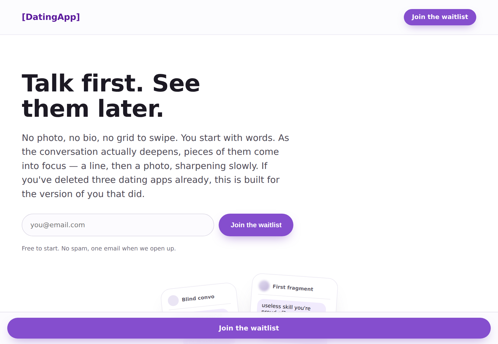
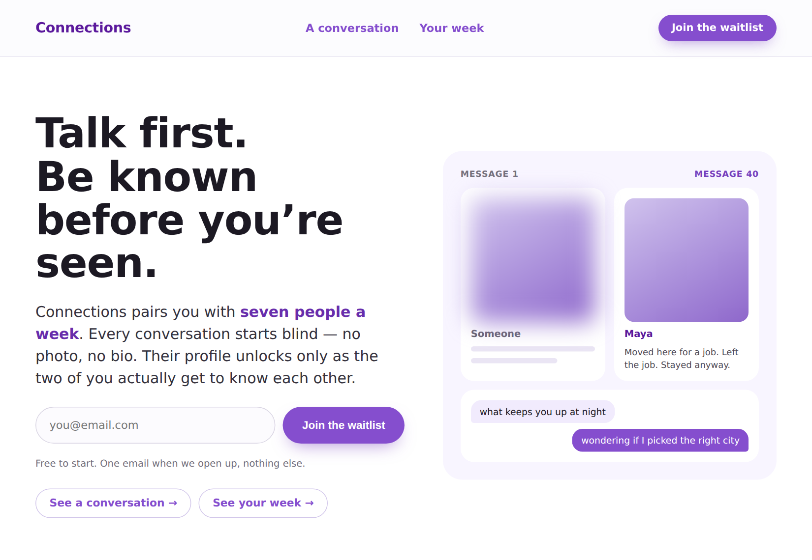
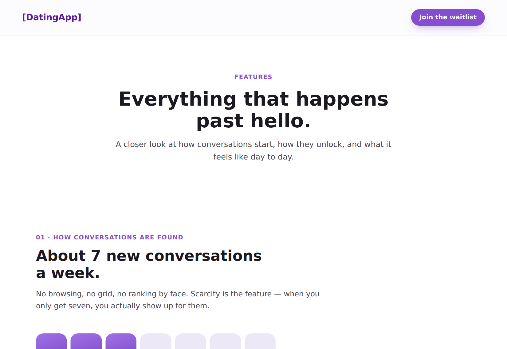
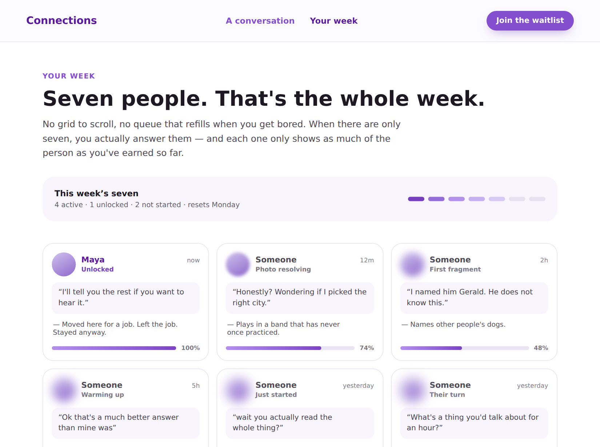

# Connections

**Live prototype:** https://dating-app-nine-chi.vercel.app
**Repo:** https://github.com/ethanhousley1/DatingApp

A blind texting app. You get seven conversations a week, each starting with no photo and no bio. The other person's profile unlocks as the two of you actually talk.

---

## 1. Need, persona, capability, and value

**Need.** Dating app usage is down ([Time article](TODO-ADD-LINK)), so there's a potential gap in the market. There are still people using dating apps for genuine connection, but there are now so many *other* reasons to be on a dating app that those people get pushed down.

**Persona.** Someone looking for an easier way to make honest connections. They've tried dating apps and decided it wasn't for them, but they also struggle to meet people in person. They need a little nudge — the equivalent of a friend making an introduction — to feel less anxiety about the whole thing.

**Capability.** Have a real conversation with a stranger before seeing their photo.

> They'd choose this over a traditional dating app because it's a more natural, organic way to meet, and because it rewards making an effort and holding a conversation. They'd choose it over meeting people in person because it takes far less time.

**Value. Something real.** After using dating apps you usually feel nothing. Either you wasted time talking to someone and the date was bad, or you got rejected. The whole thing is a dopamine cycle — see an attractive person, swipe, talk, maybe meet, repeat — and there's no real payoff at the end of it. The value here is breaking that cycle and getting people to be honest instead.

## 2. The three screens

| Screen | Its one job | Why it earned a slot | Design question it tests |
| --- | --- | --- | --- |
| **Landing** (`index.html`) | Signal the capability and the value before anything gets read | It's the only screen a first-time visitor is guaranteed to see. If "you talk before you see them" doesn't land immediately, nothing else matters | Does the concept land in five seconds, or does it need the paragraph? |
| **A conversation** (`conversation.html`) | Let you actually do the thing | The capability *is* a conversation, so the only honest way to show it is to let someone drive one. You pick replies and watch the profile resolve | Does the interaction teach the rule — asking back unlocks, spamming doesn't — without reading the caption? |
| **Your week** (`your-week.html`) | Show the whole system and the scarcity | One conversation can't show that you only get seven, or that different people sit at different depths at the same time. Seven cards at seven states does | Does seven feel like enough, or like a restriction? |

<!-- TODO: add screenshots -->
| Landing | A conversation | Your week |
| --- | --- | --- |
|  |  |  |

You can get back to the landing screen from the logo in the nav and from the footer on all three screens.

## 3. Design question plan

Questions only — no findings yet.

| Group | Question | Prediction | What the prediction rests on |
| --- | --- | --- | --- |
| **Need** | *"What makes you give up on other dating apps?"* | They give up because the apps don't work, and "work" means genuine matches. That's exactly what the core functionality has to answer — the matching and the overall flow | The pairing model and the flow across all three screens |
| **Value** | *"What would this app need to have to be better than what you use now?"* | To beat the reigning champ (Hinge) it would need to generate more possible connections and waste less time on swiping and dead-end conversations. That's core functionality and design, but it also leans on marketing and style to get people to buy in | The landing hero and the seven-a-week model on `your-week.html` |
| **Persona** | *"Where does online dating fall short for you?"* | It falls short because people aren't honestly themselves, and they're not there to have a conversation. The prototype has to answer that by keeping motivation high — by actually delivering a good conversation | The reveal mechanic on `conversation.html` |
| **Capability** | *(show the landing hero for five seconds, then hide it)*   *"How do you expect the finding and chatting process to work, regardless of this product?"* | They'll describe finding a match, learning more about them through chatting and unlocking bio and photos, and the "aha" moment being when they realize they know enough about this person to want to meet them. I'm betting current dating apps have no aha moment at all | The landing hero, `index.html` |

## 4. Design justification and first read

**Does the landing screen signal the capability and value at first glance?** No. It doesn't signal the capability before reading, for two reasons.

First, it's too wordy. The affordance sentence is three clauses long and it's carrying the entire explanation on its own — so understanding what the app does is a *reading* task, not something the screen communicates pre-attentively. Five seconds isn't enough to get through it.

Second, you can't see the demo easily. The two screens that actually prove the concept are reached through *See a conversation* and *See your week*, which are plain text links sitting low in the visual hierarchy underneath the email field. The most convincing thing I built is the part a first-time visitor is least likely to find.

**Does every element earn its place?** The elements themselves are fine — nothing on the screen is irrelevant. The problem is weighting, not content. The email field and waitlist button grouped together works well and reads as one action. But *See a conversation* and *See your week* are in the wrong position: right now they compete with the CTA for attention while still being too low to function as the primary way in. Either they should be demoted properly, or the demo should be pulled onto the landing screen so it doesn't need a link at all.

**Grouping.** The main principle at work is **proximity**. Each section is clearly established as its own block with space around it, so related things read as belonging together — the email input sits tight against the waitlist button so they read as one action, the four reveal steps sit in one row, and the depth meter, photo, and bio fragments share a single panel on the conversation screen because they're all answering the same question.

**Do screens 2 and 3 stay on mission?** Yes. Neither has a settings page or a login or a feature list — they both show the product working. And you can return to the landing screen from everywhere.

**What the AI got wrong.** The initial screens were way off. It gave me a market-research page and a marketing features page, which described the product instead of demonstrating it — neither one let you perform the capability, so a five-second test on either would only have told me whether my copy was convincing. The text was also much too wordy and repetitive across all three screens.

**What motivated each change.** The heaviest change was to the waitlist button, since it's the primary CTA and therefore the most important thing on the page. Replacing screens 2 and 3 was motivated by design question 2 — you can't find out whether the interaction teaches the rule on a page that has no interaction.

### Before and after

**Before:** [commit `045f2a1`](https://github.com/ethanhousley1/DatingApp/commit/045f2a1) — the original AI output.

<!-- TODO: add before/after screenshots -->
| | Before | After |
| --- | --- | --- |
| Landing |  |  |
| Screen 3 |  |  |

**The problem, named:** the original hero was a tagline, not an affordance. It read *"Talk first. See them later."* — which is evocative but never says what you can actually do or how often, so nothing on the screen signalled the primary capability. It's now a headline plus a sentence that states the pairing, the blind start, and the unlock condition outright.

That's an improvement, but by my own first read above it's still not a fix. The revision solved the problem at the level of *content* — the sentence now contains the capability — without solving it at the level of *signal*. It still has to be read to work. The next revision needs to carry the capability visually at the top of the screen rather than in a paragraph.

The second problem was that the waitlist button called `preventDefault()` and then did nothing at all. It's the primary CTA, so a first-time user tapping it and getting no response is the worst possible outcome — it now confirms inline.

## 5. Repo contents

| Path | What it is |
| --- | --- |
| `index.html` | Screen 1 — landing |
| `conversation.html` | Screen 2 — the blind conversation, interactive |
| `your-week.html` | Screen 3 — the weekly seven |
| `PRODUCT.md` | Longer product notes behind the prototype |
| `design-prompt.md` | The brief given to the AI agent |
| `docs/` | Screenshots |

Plain static HTML and vanilla JS. No build step. Vercel serves the repo root.
